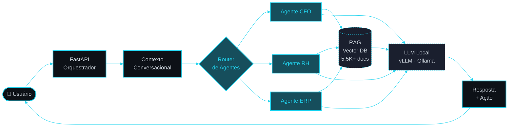

<!-- ========== HEADER: divisor gradiente ========== -->


<!-- ========== TYPING ANIMATION ========== -->
<div align="center">
  <a href="https://github.com/SylvioLeonZanotti">
    
  </a>
</div>

<br/>

<!-- ========== SNAKE ========== -->
<div align="center">
  
</div>

<br/>

<!-- ========== SOBRE ========== -->
## &nbsp;<picture><source media="(prefers-color-scheme: dark)" srcset="https://api.iconify.design/lucide/sparkles.svg?color=%2322d3ee"/></picture>&nbsp; Sobre mim

Engenheiro de IA e desenvolvedor back-end com foco em **construir sistemas de IA de ponta a ponta** — da arquitetura ao deploy. Atualmente lidero o desenvolvimento de um ecossistema com **6 agentes de IA especializados** na Areco, com infraestrutura LLM local (vLLM, Ollama) e pipelines RAG sobre **+5.500 documentos indexados**.

Meu trabalho transita entre orquestração de LLMs, engenharia de dados em GCP e APIs de alta performance em FastAPI. Curto resolver problemas reais com IA — automações que economizam horas, agentes que tomam decisão, pipelines que aguentam produção.

```yaml
location:    Campinas/SP, Brasil
role:        Engenheiro de IA & Back-end Developer
focus:       LLMs locais, RAG, multi-agent systems, MLOps
education:   Engenharia de Software — Cruzeiro do Sul (2025–2028)
languages:   PT-BR (C1) · EN (B2) · ES (A2)
contact:     leonzanotti96@gmail.com
```

<br/>

<!-- ========== STACK ========== -->
## &nbsp;<picture></picture>&nbsp; Stack

<table>
  <tr>
    <td valign="top" width="33%">

#### 🧠 IA & ML
- LLMs (vLLM, Ollama)
- RAG · Vector Search
- NLP · OCR · Fine-tuning
- GCP AI · Cloud Vision

  </td>
    <td valign="top" width="33%">

#### ⚙️ Back-end
- Python · FastAPI
- SQL · PostgreSQL
- REST APIs
- Java/TypeScript

  </td>
    <td valign="top" width="33%">

#### ☁️ Infra & DevOps
- Docker · CI/CD
- GCP (Cloud Run, BigQuery)
- Linux · WSL · Git
- NVIDIA GPU Optimization

  </td>
  </tr>
</table>

<p align="center">
  
</p>

<br/>

<!-- ========== PROJETO DE DESTAQUE ========== -->
## &nbsp;<picture></picture>&nbsp; Projeto de destaque

> **Granah AI** — Assistente Financeiro Inteligente via WhatsApp
>
> Plataforma fullstack em Python + FastAPI para automação de lançamentos financeiros, integrando OCR, scraping inteligente e NLP para extração e classificação de dados fiscais.
>
> ▸ **+2.000 notas fiscais** processadas em fase de testes
> ▸ Redução estimada de **90% no esforço manual** de conciliação
> ▸ Sistema de **fallback com LLM local** (Ollama) para resiliência e corte de custos com APIs externas
> ▸ Pipeline de ingestão com validação, normalização e persistência relacional

<br/>

<!-- ========== IMPACTO ========== -->
## &nbsp;<picture></picture>&nbsp; Impacto em produção

<table>
  <tr>
    <td align="center" width="25%">
      <h2>6</h2>
      <sub>agentes de IA<br/>especializados</sub>
    </td>
    <td align="center" width="25%">
      <h2>5.5K+</h2>
      <sub>documentos<br/>indexados em RAG</sub>
    </td>
    <td align="center" width="25%">
      <h2>2K+</h2>
      <sub>notas fiscais<br/>processadas</sub>
    </td>
    <td align="center" width="25%">
      <h2>~90%</h2>
      <sub>redução de<br/>esforço manual</sub>
    </td>
  </tr>
</table>

<sub>Métricas agregadas de projetos em produção e validação na <b>Areco</b>, <b>ROIT</b> e <b>Granah AI</b>.</sub>

<br/><br/>

<!-- ========== ARQUITETURA ========== -->
## &nbsp;<picture></picture>&nbsp; Como eu construo sistemas de IA



<sub>Padrão de arquitetura que aplico em ecossistemas multi-agent com LLM local, orquestração via FastAPI e retrieval semântico sobre base própria.</sub>

<br/>

<!-- ========== NOW / BUILDING / EXPLORING ========== -->
## &nbsp;<picture></picture>&nbsp; No momento

<table>
  <tr>
    <td valign="top" width="33%">

#### 🔭 Now
Liderando arquitetura de **6 agentes de IA** na Areco — CFO, RH, ERP e mais. Otimizando throughput de inferência local em GPU NVIDIA com vLLM.

  </td>
    <td valign="top" width="33%">

#### 🛠️ Building
Camada de orquestração conversacional em FastAPI com sumarização automática, gerenciamento de contexto e agentes multimodais com visão computacional integrados ao ERP.

  </td>
    <td valign="top" width="33%">

#### 🧪 Exploring
Estratégias avançadas de **retrieval híbrido** (dense + sparse), fine-tuning de modelos open-source para domínios específicos e padrões de avaliação para sistemas multi-agent.

  </td>
  </tr>
</table>

<br/>

<!-- ========== CONTATO ========== -->
## &nbsp;<picture></picture>&nbsp; Contato

<p align="center">
  <a href="https://www.linkedin.com/in/sylviolzanotti/" target="_blank">
    
  </a>
  <a href="mailto:leonzanotti96@gmail.com">
    
  </a>
  <a href="https://discordapp.com/users/957722095381540874" target="_blank">
    
  </a>
</p>

<!-- ========== FOOTER: divisor gradiente ========== -->

